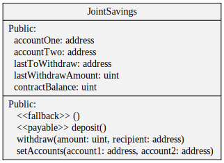
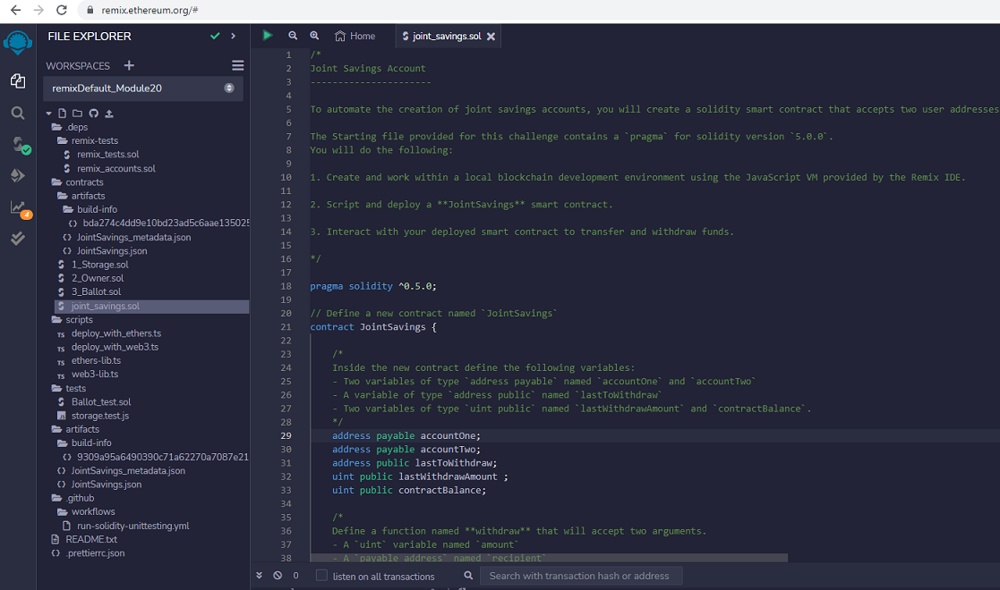
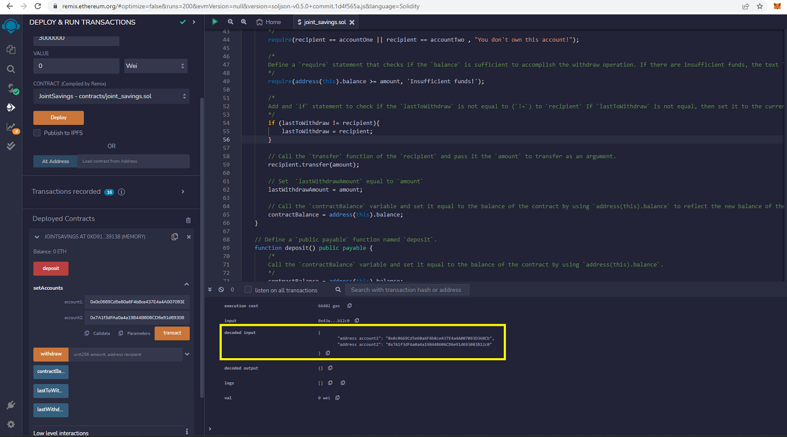
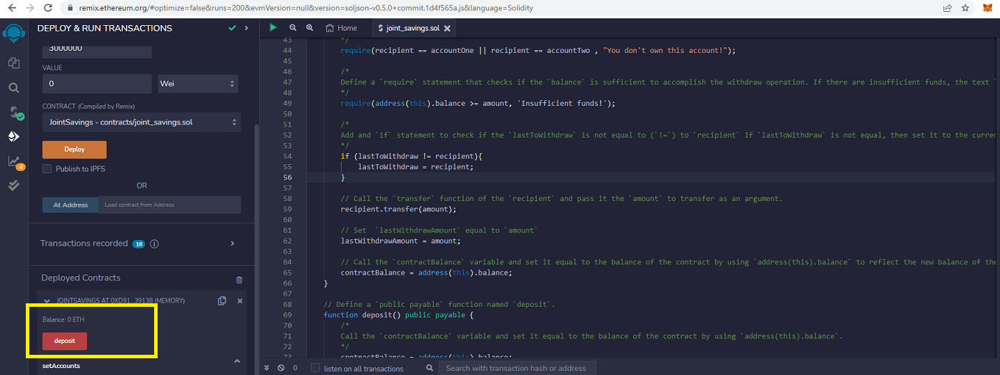
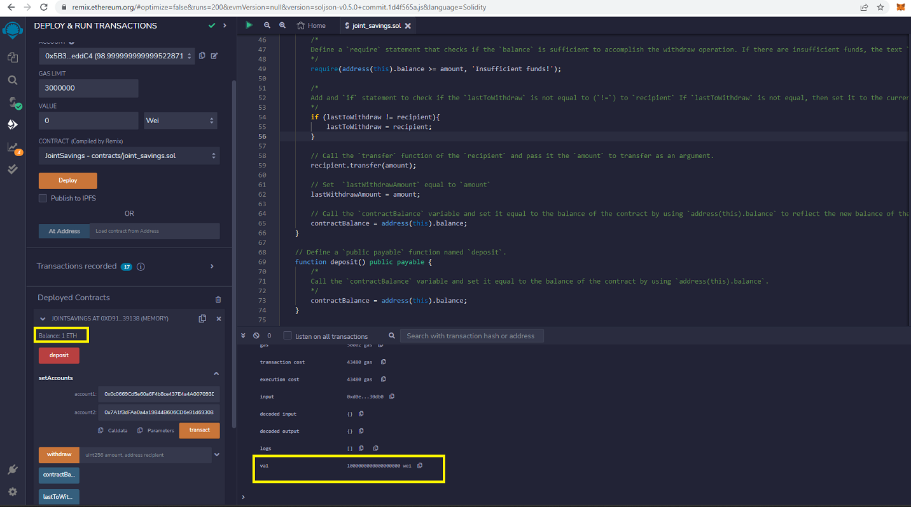
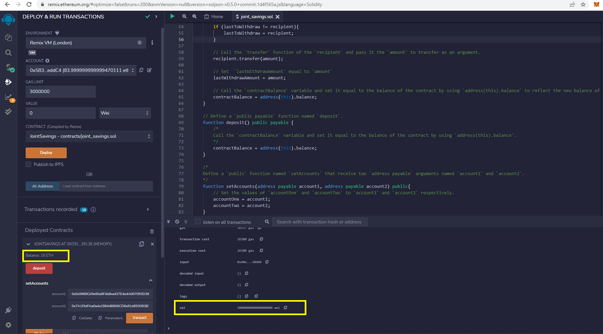
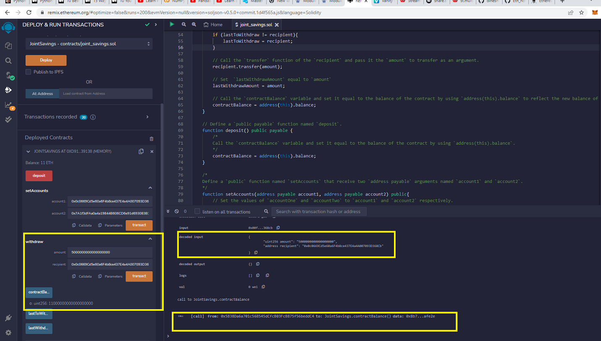
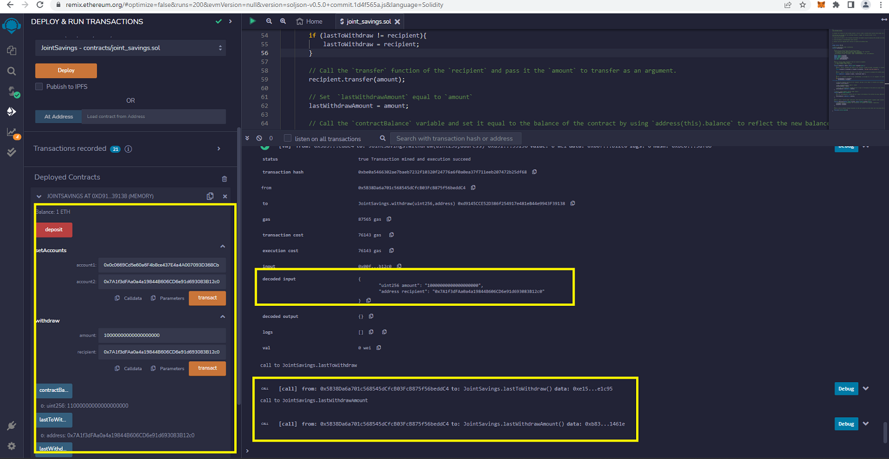
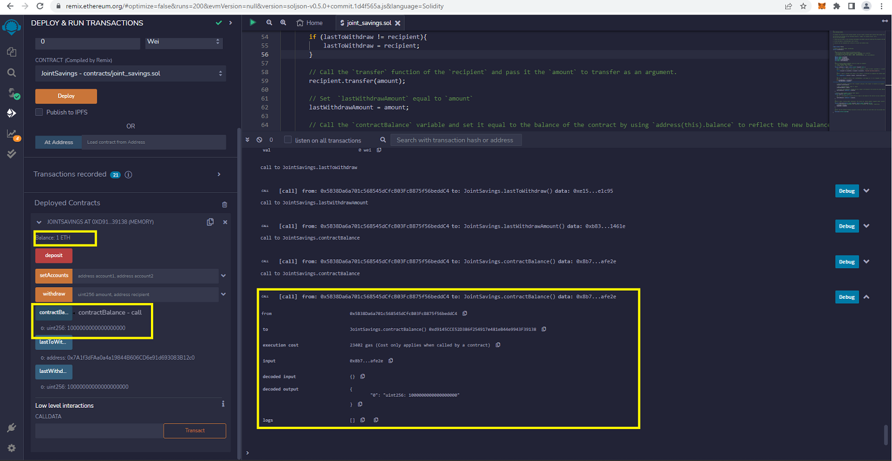

# Blockchain Savings Account
Blockchain Savings Account is a program written in Solidity programming language which runs over the Ethereum based blockchain.

## Usage Scenario
Assume, a fintech startup company has recently hired you. This company is disrupting the finance industry with its own cross-border, Ethereum-compatible blockchain that connects financial institutions. Currently, the team is building smart contracts to automate many of the institutions’ financial processes and features, such as hosting joint savings accounts.

To automate the creation of joint savings accounts, you’ll create a Solidity smart contract that accepts two user addresses. These addresses will be able to control a joint savings account. Your smart contract will use ether management functions to implement a financial institution’s requirements for providing the features of the joint savings account. These features will consist of the ability to deposit and withdraw funds from the account.

---

**Required Tool:**

The Solidity program is compiled and deployed over the Ethereum blockchain based sandbox environment called Remix VM (London), which was previously called as Javascript VM. It will simulate the blockchain transactions defined in the smart contract.

See the UML diagram of ***joint_savings.sol*** smart contract as shown below.

Use the following tools to compile and deploy the program to test.

* [Remix Ethereum IDE](https://remix-project.org/) - Remix IDE, is a no-setup tool with a GUI for developing smart contracts.
* [Ethereum Unit Converter](https://eth-converter.com/) - Ether to Wei unit convertor.

---

**Reference:**

* [Ethereum Smart Contract](https://ethereum.org/en/smart-contracts/) - A "smart contract" is simply a program that runs on the Ethereum blockchain. It's a collection of code (its functions) and data (its state) that resides at a specific address on the Ethereum blockchain.

--
## Usage

To use the smart contract, follow the key steps described as below:

- Clone the repository and load ***joint_savings.sol*** in Remix IDE. You may see the web console view as:

- While deploying, select Remix VM (London) as a sandbox environment.

- You may compile and deploy the smart contract to use it further.

---
## Blockchain Savings Account Test Results

**Note:** Take note of 'account1' and 'account2' Addresses in the Transactions window of the Remix IDE.

|Scenario: Set Accounts|
|:-:|
||

---

|Scenario: Initial Balance|
|:-:|
||

---

|Scenario: Deposit 1 ETH|
|:-:|
||

---

|Scenario: Deposit 10 ETH|
|:-:|
||

---

|Scenario: Deposit 5 ETH|
|:-:|
||

---

|Scenario: Withdraw 5 ETH|
|:-:|
||

---

|Scenario: Withdraw 10 ETH|
|:-:|
||

---

|Scenario: Final Balance|
|:-:|
||

---

## Contributors

FinTech Labs, Inc.

---

## License

None